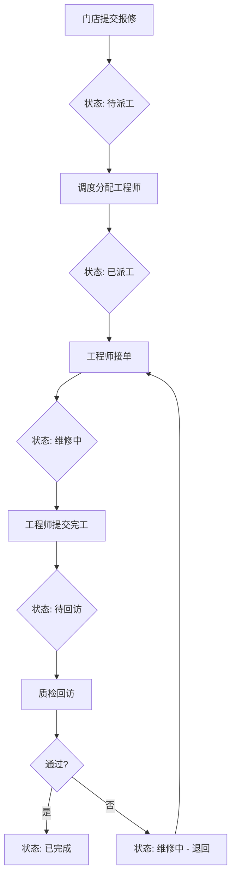

# 门店报修派工与回访工作台 - 产品需求文档

## 1. 产品概述

一个完整的门店报修工单管理系统，支持从门店提交报修、调度分配工程师、工程师维修处理、到质检回访关单的完整业务流程。

### 核心价值
- **角色分离**：门店、调度、工程师、质检四个独立角色，各司其职
- **流程可控**：严格的工单状态流转，防止越权操作
- **可追溯**：完整的操作历史时间线，记录每次派工、退回、回访的详情
- **防错设计**：内置失败路径处理，阻止非法操作

### 目标用户
- **门店**：提交报修请求，查看工单进度
- **调度**：分配工程师，处理抢派冲突
- **工程师**：接单维修，记录处理过程
- **质检**：回访确认，质量把关

---

## 2. 核心功能

### 2.1 用户角色

| 角色 | 标识颜色 | 核心权限 |
|------|---------|---------|
| 门店 | 蓝色 | 提交报修、查看本店工单 |
| 调度 | 橙色 | 查看待派工单、分配工程师、处理抢派冲突 |
| 工程师 | 绿色 | 接单、维修处理、提交完工 |
| 质检 | 紫色 | 回访评价、关单/退回 |

### 2.2 功能模块

1. **角色切换台**：顶部角色选择器，一键切换身份
2. **工单工作台**：根据角色显示不同视图的工单列表
3. **工单详情**：完整的工单信息、维修记录、时间线
4. **新建报修**：门店提交报修表单
5. **派工面板**：调度分配工程师的交互界面
6. **维修记录**：工程师记录维修步骤和结果
7. **回访表单**：质检回访确认和备注

### 2.3 页面详情

| 页面 | 模块 | 功能描述 |
|------|------|---------|
| 主工作台 | 角色切换器 | 切换门店/调度/工程师/质检身份 |
| 主工作台 | 工单统计卡片 | 显示各状态工单数量 |
| 主工作台 | 筛选面板 | 按状态、时间、关键词筛选 |
| 主工作台 | 工单列表 | 根据角色显示不同状态范围的工单 |
| 工单详情 | 基本信息 | 工单号、门店、报修内容、创建时间 |
| 工单详情 | 派工信息 | 当前工程师、指派时间 |
| 工单详情 | 维修记录 | 工程师填写的维修过程 |
| 工单详情 | 时间线 | 所有操作历史（派工、退回、回访） |
| 工单详情 | 回访备注 | 质检填写的回访评价 |
| 新建报修 | 报修表单 | 门店填写设备、故障描述 |
| 派工面板 | 工程师选择 | 选择可用的工程师 |
| 派工面板 | 紧急标记 | 标记紧急工单 |
| 维修记录 | 处理表单 | 工程师填写维修步骤 |
| 回访表单 | 评价选择 | 满意/基本满意/不满意 |
| 回访表单 | 备注输入 | 回访详细说明 |

---

## 3. 核心流程

### 3.1 主业务流程



### 3.2 失败路径处理

#### 路径1: 并发抢派
```
场景：两个调度同时对同一张待派工单进行派工
处理：
1. 先到先得，后到的调度收到"该工单已被其他调度派工"提示
2. 工单状态立即锁定，防止race condition
3. 被抢的调度看到工单已变为"已派工"状态
```

#### 路径2: 工程师提前关单
```
场景：工程师在质检回访前自行关单
处理：
1. 系统阻止非质检角色关闭工单
2. 工程师只能提交"完工"操作，状态变为"待回访"
3. 必须由质检完成回访后才能最终关单
```

#### 路径3: 已撤销工单重开
```
场景：尝试重开已撤销的工单
处理：
1. 撤销后的工单状态为"已撤销"，不可逆
2. 任何操作都无法将已撤销工单恢复
3. 如需重新处理，需由门店提交新的报修
```

### 3.3 工单状态机

| 状态 | 可执行操作 | 可转换到 |
|------|----------|---------|
| 待派工 | 派工 | 已派工 |
| 已派工 | 接单 | 维修中 |
| 维修中 | 提交完工、退回 | 待回访、维修中 |
| 待回访 | 回访通过/不通过 | 已完成、维修中 |
| 已完成 | 无 | 无 |
| 已撤销 | 无 | 无 |

---

## 4. 用户界面设计

### 4.1 设计风格
- **主题**：工业控制台风格，深色背景，专业高效
- **主色调**：深灰 #1a1a2e，背景 #16213e
- **角色配色**：
  - 门店：#3498db（蓝）
  - 调度：#e67e22（橙）
  - 工程师：#27ae60（绿）
  - 质检：#9b59b6（紫）
- **字体**：思源黑体/Noto Sans SC
- **布局**：卡片式布局，左侧列表，右侧详情

### 4.2 页面设计概览

| 页面 | 模块 | UI 元素 |
|------|------|--------|
| 主工作台 | 顶部导航 | 角色选择器、标题 |
| 主工作台 | 统计卡片 | 4个状态统计、角色色标识 |
| 主工作台 | 筛选栏 | 状态筛选、日期范围、关键词 |
| 主工作台 | 工单列表 | 卡片列表，显示关键信息 |
| 工单详情 | 侧边面板 | 完整信息展示 |
| 工单详情 | 时间线 | 竖向时间轴，图标+描述 |

### 4.3 响应式设计
- **桌面优先**：1200px+ 最佳体验
- **平板适配**：1024px 侧边栏折叠
- **移动端**：不作为主要目标，但保持基本可用

---

## 5. 样例数据

### 5.1 样例门店
| 门店名称 | 地址 | 联系人 | 联系电话 |
|---------|------|--------|---------|
| 朝阳店 | 北京市朝阳区建国路88号 | 张经理 | 138-0001-0001 |
| 海淀店 | 北京市海淀区中关村大街1号 | 李主管 | 138-0002-0002 |
| 浦东店 | 上海市浦东新区陆家嘴环路1000号 | 王店长 | 138-0003-0003 |

### 5.2 样例工程师
| 姓名 | 工号 | 专长 |
|------|------|------|
| 赵师傅 | ENG001 | 空调维修 |
| 钱师傅 | ENG002 | 制冷设备 |
| 孙师傅 | ENG003 | 电气维修 |

### 5.3 样例工单
1. **WO-2024-0001**：朝阳店，报修空调不制冷，状态: 待派工
2. **WO-2024-0002**：海淀店，报修冷柜温度异常，状态: 维修中（赵师傅处理中）
3. **WO-2024-0003**：浦东店，报修收银机故障，状态: 待回访（等待质检回访）

---

## 6. 验收标准

### 6.1 功能验收
- [ ] 门店可提交报修并生成工单
- [ ] 调度可查看待派工单并进行派工操作
- [ ] 工程师可接单、维修记录、提交完工
- [ ] 质检可回访、评价、关单/退回
- [ ] 角色切换流畅，显示对应权限的工单
- [ ] 工单状态流转符合状态机定义
- [ ] 失败路径被正确阻止并有提示

### 6.2 数据验收
- [ ] 工单状态在刷新后保持
- [ ] 筛选条件在刷新后保持
- [ ] 回访备注在刷新后保持
- [ ] 导出结果在刷新后可用

### 6.3 演示验收
- [ ] README 中的演示步骤可完整执行
- [ ] 演示数据能覆盖所有核心路径
