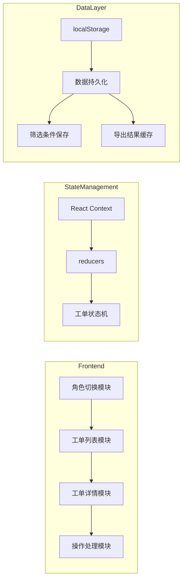

# 门店报修派工与回访工作台 - 技术架构文档

## 1. 架构设计



### 架构说明
- **单页应用**：使用 React + Vite 构建，无需后端
- **状态管理**：React Context + useReducer 管理全局状态
- **数据持久化**：localStorage 存储工单数据和用户偏好
- **并发控制**：乐观锁机制处理抢派冲突

---

## 2. 技术栈

| 技术 | 版本 | 用途 |
|------|------|------|
| React | 18.x | UI 框架 |
| Vite | 5.x | 构建工具 |
| TailwindCSS | 3.x | 样式框架 |
| Lucide React | 最新 | 图标库 |
| date-fns | 3.x | 日期处理 |

### 初始化方式
```bash
npm create vite@latest . -- --template react
npm install
npm install -D tailwindcss postcss autoprefixer
npx tailwindcss init -p
npm install lucide-react date-fns
```

---

## 3. 路由定义

| 路径 | 组件 | 用途 |
|------|------|------|
| / | App | 主工作台 |
| /new | NewRepair | 新建报修页面 |
| /order/:id | OrderDetail | 工单详情页面 |

---

## 4. 数据模型

### 4.1 数据模型定义

```mermaid
erDiagram
    WORK_ORDER ||--|| STORE : belongs_to
    WORK_ORDER ||--|| ENGINEER : assigned_to
    WORK_ORDER ||--o{ TIMELINE : has
    TIMELINE ||--|| USER : created_by
    
    WORK_ORDER {
        string id PK
        string orderNo 工单号
        string storeId FK 门店ID
        string description 故障描述
        string equipment 设备类型
        string status 状态
        string engineerId FK 工程师ID
        timestamp createdAt 创建时间
        timestamp updatedAt 更新时间
    }
    
    STORE {
        string id PK
        string name 门店名称
        string address 地址
        string contact 联系人
        string phone 联系电话
    }
    
    ENGINEER {
        string id PK
        string name 姓名
        string employeeNo 工号
        string expertise 专长
        string status 状态
    }
    
    TIMELINE {
        string id PK
        string workOrderId FK 工单ID
        string action 动作类型
        string description 描述
        string operator 操作人
        string role 角色
        timestamp createdAt 创建时间
    }
```

### 4.2 工单状态枚举

```typescript
enum WorkOrderStatus {
  PENDING_DISPATCH = '待派工',      // 门店提交后
  DISPATCHED = '已派工',           // 调度已分配
  IN_REPAIR = '维修中',           // 工程师接单
  PENDING_REVIEW = '待回访',      // 完工待回访
  COMPLETED = '已完成',           // 质检通过
  CANCELLED = '已撤销'            // 已撤销
}
```

### 4.3 时间线动作枚举

```typescript
enum TimelineAction {
  CREATED = '创建工单',
  DISPATCHED = '派工',
  ACCEPTED = '接单',
  REPAIR_START = '开始维修',
  REPAIR_COMPLETE = '完工提交',
  RETURNED = '退回',
  REVIEW_PASS = '回访通过',
  REVIEW_FAIL = '回访不通过',
  CANCELLED = '撤销'
}
```

---

## 5. 核心模块设计

### 5.1 状态管理架构

```typescript
// 全局状态结构
interface AppState {
  currentRole: Role;
  workOrders: WorkOrder[];
  stores: Store[];
  engineers: Engineer[];
  filters: FilterState;
  timelineMap: Record<string, Timeline[]>;
}

// 操作类型
type Action =
  | { type: 'SET_ROLE'; payload: Role }
  | { type: 'SET_WORK_ORDERS'; payload: WorkOrder[] }
  | { type: 'DISPATCH_ORDER'; payload: { orderId: string; engineerId: string } }
  | { type: 'ACCEPT_ORDER'; payload: string }
  | { type: 'UPDATE_REPAIR'; payload: { orderId: string; repairRecord: string } }
  | { type: 'SUBMIT_COMPLETE'; payload: string }
  | { type: 'REVIEW_PASS'; payload: { orderId: string; remark: string } }
  | { type: 'REVIEW_FAIL'; payload: { orderId: string; remark: string } }
  | { type: 'CANCEL_ORDER'; payload: string }
  | { type: 'ADD_TIMELINE'; payload: Timeline }
  | { type: 'SET_FILTERS'; payload: FilterState };
```

### 5.2 并发控制机制

```typescript
// 派工时的乐观锁检查
function dispatchOrder(orderId: string, engineerId: string, version: number): Result {
  const order = getOrder(orderId);
  
  // 检查工单是否仍是待派工状态
  if (order.status !== WorkOrderStatus.PENDING_DISPATCH) {
    return { success: false, error: '该工单已被其他调度派工' };
  }
  
  // 检查版本号（防止并发）
  if (order.version !== version) {
    return { success: false, error: '工单已被修改，请刷新后重试' };
  }
  
  // 执行派工
  return { success: true };
}
```

### 5.3 权限矩阵

| 操作 | 门店 | 调度 | 工程师 | 质检 |
|------|------|------|--------|------|
| 提交报修 | ✅ | ❌ | ❌ | ❌ |
| 查看待派工 | ❌ | ✅ | ❌ | ❌ |
| 派工 | ❌ | ✅ | ❌ | ❌ |
| 接单 | ❌ | ❌ | ✅ | ❌ |
| 维修记录 | ❌ | ❌ | ✅ | ❌ |
| 完工提交 | ❌ | ❌ | ✅ | ❌ |
| 回访评价 | ❌ | ❌ | ❌ | ✅ |
| 关单/退回 | ❌ | ❌ | ❌ | ✅ |
| 撤销工单 | ✅(自己的) | ❌ | ❌ | ❌ |

---

## 6. 组件结构

```
src/
├── components/
│   ├── RoleSwitcher.tsx          # 角色切换器
│   ├── StatisticsCards.tsx       # 统计卡片
│   ├── FilterPanel.tsx           # 筛选面板
│   ├── WorkOrderList.tsx         # 工单列表
│   ├── WorkOrderCard.tsx         # 工单卡片
│   ├── WorkOrderDetail.tsx       # 工单详情
│   ├── Timeline.tsx              # 时间线
│   ├── RepairForm.tsx            # 维修记录表单
│   ├── ReviewForm.tsx            # 回访表单
│   ├── DispatchPanel.tsx         # 派工面板
│   └── NewRepairForm.tsx         # 新建报修表单
├── context/
│   └── AppContext.tsx            # 全局状态管理
├── data/
│   └── initialData.ts            # 初始数据
├── types/
│   └── index.ts                  # 类型定义
├── utils/
│   ├── storage.ts                # localStorage 工具
│   └── validators.ts             # 验证工具
├── App.tsx
├── main.tsx
└── index.css
```

---

## 7. 持久化策略

### 7.1 localStorage 键值

| 键名 | 数据类型 | 用途 |
|------|---------|------|
| workOrders | WorkOrder[] | 工单数据 |
| timelineMap | Record<string, Timeline[]> | 时间线数据 |
| currentRole | Role | 当前角色 |
| filters | FilterState | 筛选条件 |
| exports | ExportResult[] | 导出结果 |

### 7.2 数据恢复

```typescript
// 应用初始化时恢复数据
function loadPersistedData(): Partial<AppState> {
  return {
    workOrders: JSON.parse(localStorage.getItem('workOrders') || '[]'),
    timelineMap: JSON.parse(localStorage.getItem('timelineMap') || '{}'),
    currentRole: localStorage.getItem('currentRole') as Role || 'store',
    filters: JSON.parse(localStorage.getItem('filters') || '{}')
  };
}

// 状态变更时持久化
useEffect(() => {
  localStorage.setItem('workOrders', JSON.stringify(state.workOrders));
  localStorage.setItem('timelineMap', JSON.stringify(state.timelineMap));
  localStorage.setItem('currentRole', state.currentRole);
  localStorage.setItem('filters', JSON.stringify(state.filters));
}, [state]);
```

---

## 8. 失败路径实现

### 8.1 并发抢派处理

```typescript
// 使用版本号实现乐观锁
interface WorkOrder {
  version: number; // 每次修改递增
}

// 派工时检查
function handleDispatch(orderId: string, engineerId: string) {
  const order = state.workOrders.find(o => o.id === orderId);
  
  if (order?.status !== '待派工') {
    alert('该工单已被其他调度派工，当前状态: ' + order?.status);
    return;
  }
  
  // 执行派工，版本号+1
  dispatch({ type: 'DISPATCH_ORDER', payload: { orderId, engineerId } });
}
```

### 8.2 提前关单拦截

```typescript
// 只有质检角色可以关单
function handleCloseOrder(orderId: string) {
  if (state.currentRole !== 'quality') {
    alert('只有质检人员可以关单');
    return;
  }
  
  if (state.currentOrder?.status !== '待回访') {
    alert('工单必须经过回访才能关单');
    return;
  }
  
  dispatch({ type: 'CLOSE_ORDER', payload: orderId });
}
```

### 8.3 撤销工单保护

```typescript
function handleCancelOrder(orderId: string) {
  const order = state.workOrders.find(o => o.id === orderId);
  
  if (order?.status === '已撤销') {
    alert('该工单已撤销，无法再次操作');
    return;
  }
  
  if (order?.status === '已完成') {
    alert('已完成的工单不能撤销');
    return;
  }
  
  dispatch({ type: 'CANCEL_ORDER', payload: orderId });
}
```

---

## 9. 样式规范

### 9.1 CSS 变量

```css
:root {
  --bg-primary: #1a1a2e;
  --bg-secondary: #16213e;
  --bg-card: #1f2937;
  --text-primary: #f3f4f6;
  --text-secondary: #9ca3af;
  
  --role-store: #3498db;
  --role-dispatch: #e67e22;
  --role-engineer: #27ae60;
  --role-quality: #9b59b6;
  
  --status-pending: #fbbf24;
  --status-progress: #3b82f6;
  --status-success: #10b981;
  --status-error: #ef4444;
}
```

### 9.2 动画效果

```css
/* 卡片悬停 */
.card-hover {
  transition: transform 0.2s, box-shadow 0.2s;
}
.card-hover:hover {
  transform: translateY(-2px);
  box-shadow: 0 10px 40px rgba(0, 0, 0, 0.3);
}

/* 时间线入场 */
.timeline-item {
  animation: slideIn 0.3s ease-out;
}
@keyframes slideIn {
  from {
    opacity: 0;
    transform: translateX(-20px);
  }
  to {
    opacity: 1;
    transform: translateX(0);
  }
}
```
